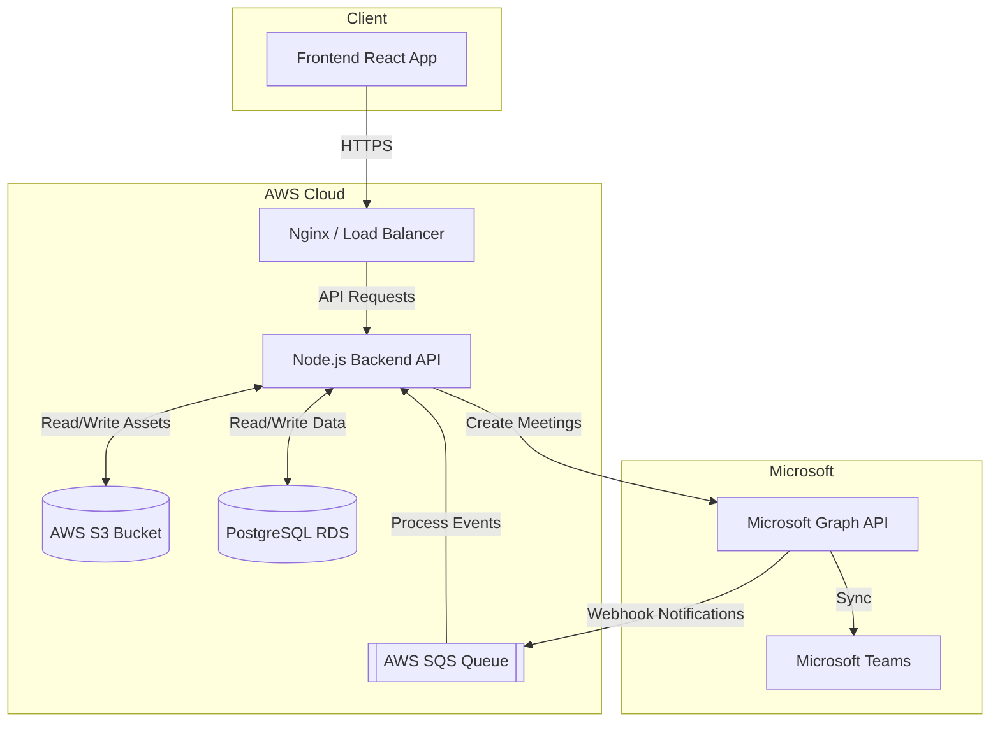

# Z2 Graph API Project - Teams Integration Overview

Welcome to the **Z2 Graph API Project**! This document is designed for new trainees to easily understand the architecture, workflows, and integrations (Teams, AWS, RDS) of our Interview Management System (IMS).

---

## 🏗️ Architecture Diagram

---

## 🔄 Core Workflow

1. **Scheduling an Interview**: A user schedules an interview via the Frontend React App.
2. **Creating Teams Meeting**: The Backend Node.js API talks to the Microsoft Graph API to create a Microsoft Teams meeting link.
3. **Storing Data**: Interview details and the Teams meeting link are stored securely in our **PostgreSQL RDS** database.
4. **Webhook Notifications**: Microsoft Graph sends real-time webhook events (e.g., meeting updates) to our backend.
5. **Event Queuing**: To handle high traffic, the backend places incoming webhooks into an **AWS SQS** queue for reliable asynchronous processing.
6. **Asset Management**: Interview recordings, resumes, and other files are uploaded to and served directly from **AWS S3**.

---

## 🔑 Required Permissions

To run and deploy this project, specific permissions are required across platforms:

### Microsoft Graph API (Azure AD)
- **Application Mode**: Requires `CLIENT_ID`, `CLIENT_SECRET`, and `TENANT_ID`.
- Needs permissions to create and manage Teams meetings on behalf of users.

### AWS IAM (Identity and Access Management)
- **S3 Access**: `s3:PutObject`, `s3:GetObject` on the `prod-interview-assets` bucket.
- **SQS Access**: `sqs:SendMessage`, `sqs:ReceiveMessage`, `sqs:DeleteMessage` on the `webhook-queue.fifo`.
- **RDS Access**: VPC security group permissions allowing inbound PostgreSQL (5432) traffic only from the backend.

---

## 🪣 AWS S3 Integration

AWS S3 is used as our highly scalable file storage system.
- **What we store**: Candidate resumes, interview recordings, and related assets.
- **How it works**: The backend securely communicates with S3 using the AWS SDK. We upload files to a designated bucket (e.g., `prod-interview-assets`) and serve them to authorized users via the frontend.

---

## 🗄️ PostgreSQL (RDS) Integration

We use AWS RDS (PostgreSQL 16) as our primary relational database.
- **Connection**: Managed via **Prisma ORM**. The database connection URL is securely injected via environment variables.
- **Architecture**: In production, the database is placed in a Private Subnet (no public internet access) and is only accessible from the Backend app.
- **Scaling**: We use RDS Proxy to handle connection pooling, ensuring the database stays stable even when the Node.js backend scales up under heavy load.

---

## 🚀 Summary for Trainees

- **Backend**: Node.js / Express
- **Database**: PostgreSQL (via AWS RDS)
- **Storage**: AWS S3
- **Message Queue**: AWS SQS (for Graph Webhooks)
- **External API**: Microsoft Graph API for Teams Meetings

This modern stack allows the platform to be highly reliable, scalable, and resilient!
